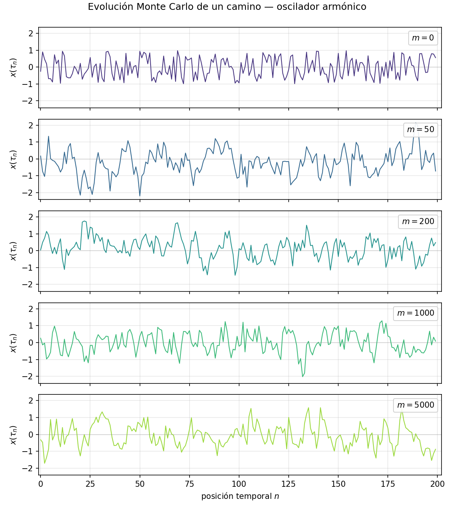
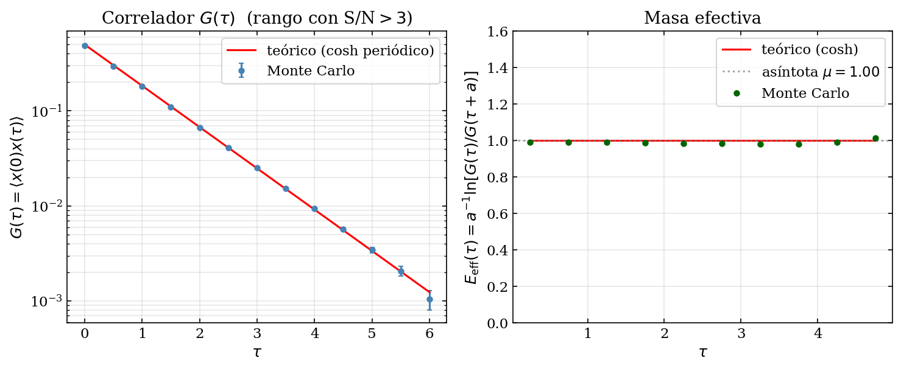
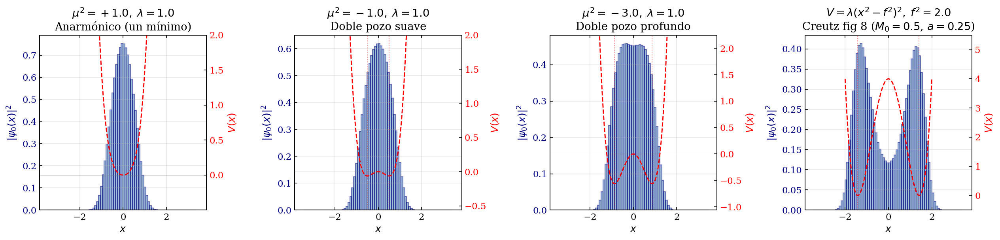
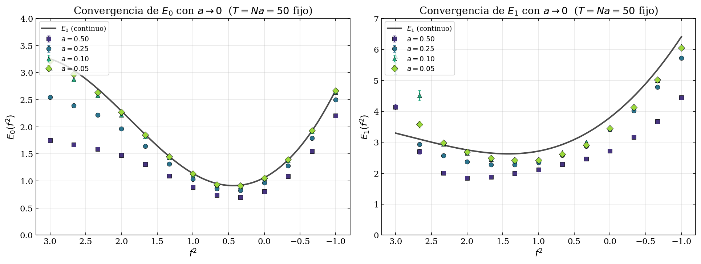
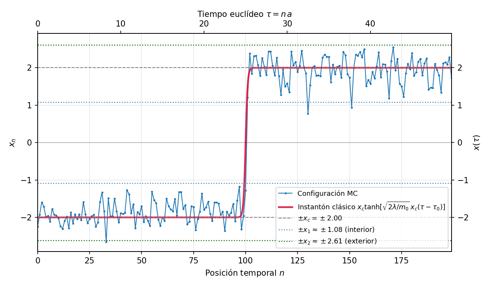
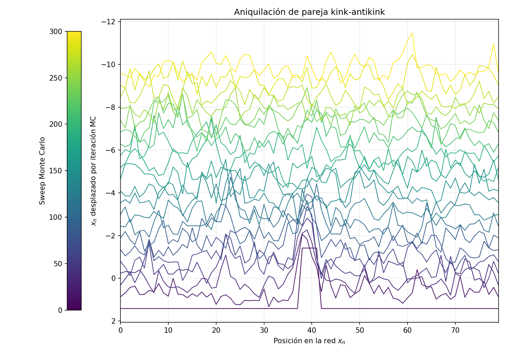
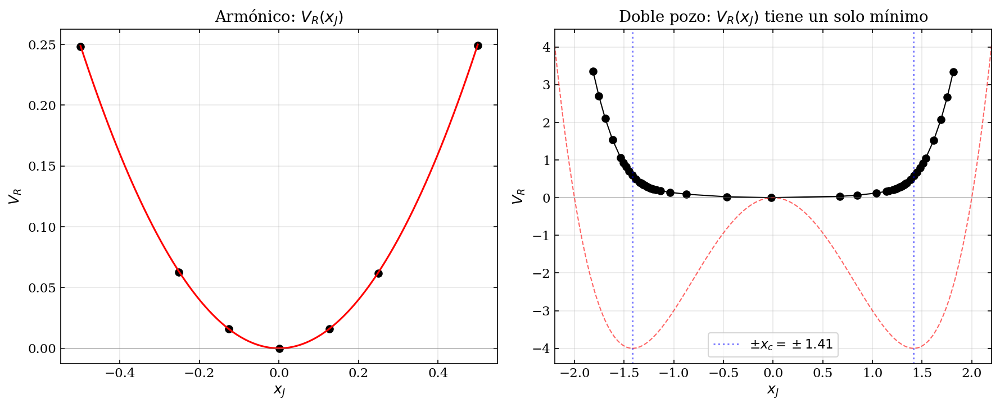
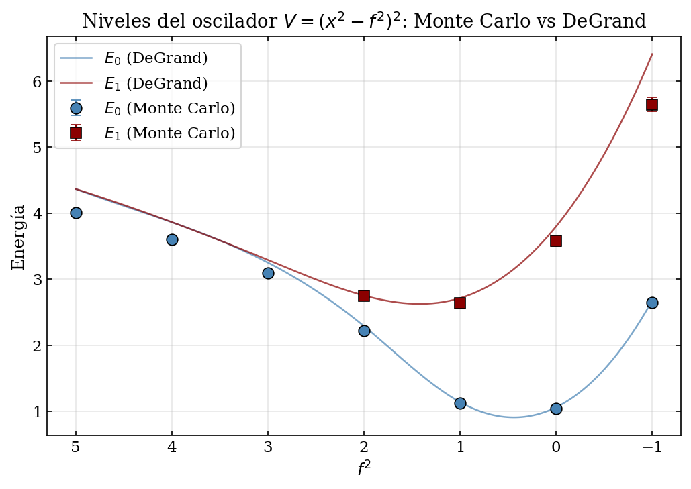
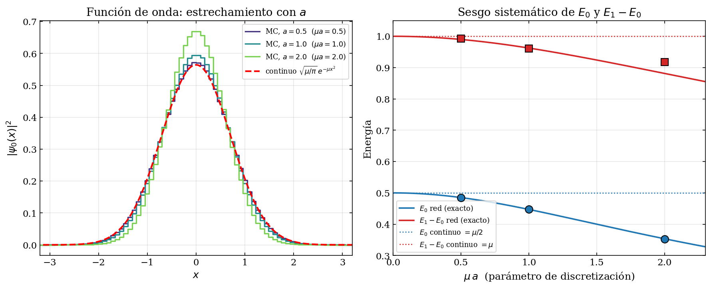

# Path-Integral-Monte-Carlo

Lattice Monte Carlo simulation of quantum mechanics in Euclidean (imaginary) time, following the method of **Creutz & Freedman (Ann. Phys. 132, 1981)**. Implements the Metropolis algorithm on a discrete path-integral lattice to compute ground-state wavefunctions, energy levels, external-source response, renormalised effective potentials, and instanton configurations in the double-well potential. Numba JIT-compiled; all results compared against exact analytical predictions and the Blankenbecler-DeGrand-Sugar benchmark.

## Repository structure

```
Path-Integral-Monte-Carlo/
├── scripts/
│   ├── utils.py                     # Numba-accelerated Metropolis engine + observables
│   ├── 01_armonico.py               # Harmonic oscillator — method validation
│   ├── 02_anarmonico.py             # Anharmonic oscillator — wavefunctions & energy levels
│   ├── 03_pozo_doble.py             # Double well — instantons & quantum tunnelling
│   ├── 04_fuente_externa.py         # External source coupling ⟨x⟩_J vs J
│   ├── 05_potencial_efectivo.py     # Renormalised effective potential V_R(x)
│   ├── 06_degrand_comparacion.py    # Comparison with Blankenbecler-DeGrand-Sugar (1980)
│   ├── 07_discretizacion_armonico.py# Lattice discretisation errors O((μa)²)
│   └── run_all.py                   # Runner — executes scripts 01-07 sequentially
├── figures/
│   ├── fig_01_caminos_armonico.png
│   ├── fig_03_correlador_armonico.png
│   ├── fig_05_psi0_armonico.png
│   ├── fig_08_09_psi_anarmonico.png
│   ├── fig_10_niveles_anarmonico.png
│   ├── fig_11_J_armonico.png
│   ├── fig_12_J_doble_pozo.png
│   ├── fig_13_VR_armonico.png
│   ├── fig_14_VR_doble_pozo.png
│   ├── fig_13_14_comparacion_VR.png
│   ├── fig_15_kink_simple.png
│   ├── fig_16_tunneling_clasico.png
│   ├── fig_17_aniquilacion_kinks.png
│   ├── fig_18_degrand_comparacion.png
│   ├── fig_18_discretizacion_armonico.png
│   ├── fig_19_error_degrand.png
│   └── fig_psi0_doble_pozo.png
├── .gitattributes
├── .gitignore
└── README.md
```

---

## Physical method

### Euclidean path integral and lattice discretisation

The quantum partition function in imaginary time $\tau = it$ is:

$$Z = \int \mathcal{D}x(\tau)\, e^{-S_E[x]/\hbar}$$

where the Euclidean action is:

$$S_E = \int_0^\beta d\tau \left[\frac{M_0}{2}\dot{x}^2 + V(x)\right]$$

On a lattice of $N$ sites with spacing $a$ and periodic boundary conditions ($x_N = x_0$, corresponding to inverse temperature $\beta = Na$), this becomes:

$$S_E = \sum_{i=0}^{N-1} a \left[\frac{M_0}{2}\left(\frac{x_{i+1}-x_i}{a}\right)^2 + V(x_i)\right]$$

The ground-state properties are extracted in the $\beta \to \infty$ limit ($Na \gg 1/E_1$).

### Metropolis algorithm

A single sweep proposes $x_i \to x_i + \delta$ for each site sequentially. The proposal is accepted with probability:

$$P_{\rm acc} = \min(1,\, e^{-\Delta S_E})$$

After thermalisation ($N_{\rm therm}$ sweeps) measurements are taken every $N_{\rm skip}$ sweeps to reduce autocorrelations.

### Observables

| Observable | Estimator |
|---|---|
| Ground-state energy | $E_0 = \langle \frac{M_0}{2a^2}(x_i-x_{i-1})^2 + V(x_i)\rangle$ |
| Wavefunction $\|\psi_0(x)\|^2$ | Histogram of $x_i$ values |
| 2-point correlator | $G(\tau) = \langle x_0\,x_k\rangle - \langle x\rangle^2 \propto e^{-(E_1-E_0)\tau}$ |
| Energy gap | $\Delta E = E_1 - E_0$ extracted from slope of $\log G(\tau)$ |

---

## Results

### 1. Harmonic oscillator — validation

Potential: $V(x) = \frac{1}{2}\mu^2 x^2$ with $M_0 = 1$, $\mu = 1$.

Exact results reproduced:
- $E_0 = \mu/2$
- $\langle x^2\rangle = 1/(2\mu)$, $\langle x^4\rangle = 3/(4\mu^2)$
- $|\psi_0(x)|^2 = (\mu/\pi)^{1/2} e^{-\mu x^2}$

#### Typical paths and ground-state wavefunction



*Left: ensemble of Metropolis paths $x(\tau)$ for the harmonic oscillator — quantum fluctuations around $x=0$. Right: measured $|\psi_0(x)|^2$ vs exact Gaussian.*



*Two-point correlator $G(\tau)$: exponential decay $\propto e^{-\Delta E\,\tau}$ gives $\Delta E = E_1 - E_0 = \mu = 1$ (exact).*

---

### 2. Anharmonic oscillator and double well

Potential: $V(x) = \frac{1}{4}\mu^2(x^2 - f^2)^2$

- For $f^2 < 0$: single anharmonic well
- For $f^2 > 0$: symmetric double well with minima at $x = \pm f$

#### Wavefunctions and energy levels



*$|\psi_0(x)|^2$ for the anharmonic oscillator (left) and double well (right). In the double well, tunnelling splits the ground state into an even superposition centred on both minima.*



*$E_0$ and $E_1$ vs $f^2$. At $f^2 = 0$ (harmonic limit) $E_1 - E_0 = \mu$. As $f^2$ grows the tunnel splitting $\Delta E = E_1 - E_0$ decreases exponentially — instanton suppression.*

---

### 3. Double well — instantons and quantum tunnelling

Antiperiodic boundary conditions ($x_N = -x_0$) force paths to visit both wells, producing **kink** (instanton) configurations — classical solutions to the Euclidean equation of motion:

$$x_{\rm kink}(\tau) = f\,\tanh\!\left(\frac{\tau - \tau_0}{\xi}\right), \qquad \xi = \frac{1}{\sqrt{2\lambda}\,f}$$

These are the dominant contributions to the tunnelling amplitude $\langle -f | e^{-\beta H}|+f\rangle$.

#### Kink configurations



*A single kink: the path transitions from $x \approx -f$ to $x \approx +f$ within a characteristic width $\xi$. The red dashed curve is the analytical instanton solution.*



*Kink-antikink pair undergoing annihilation: the two topological defects approach and annihilate, returning the path to a trivial configuration.*

---

### 4. External source and effective potential

Adding a linear source $J$ to the action — $S' = S_E + J\sum_i x_i$ — allows computation of $\langle x\rangle_J$ and the **renormalised effective potential**:

$$\Gamma(x_J) = -\ln Z[J] + J\,x_J, \qquad x_J = \langle x\rangle_J$$

Key result: even in the double-well case, $\Gamma(x)$ has a **single minimum** — there is no spontaneous symmetry breaking in quantum mechanics (only in QFT in the thermodynamic limit).



*Left: effective potential $V_R(x)$ for the harmonic oscillator — parabola with curvature $\mu^2$ (exact). Right: $V_R(x)$ for the double well — single-minimum shape confirms the absence of SSB.*

---

### 5. DeGrand comparison and discretisation errors

Comparison with **Blankenbecler, DeGrand & Sugar (Phys. Rev. D 21, 1055, 1980)** for $H = p^2 + \lambda(x^2-f^2)^2$, sweeping $f^2 \in [-1,5]$.



*$E_0$ and $\Delta E = E_1 - E_0$ vs $f^2$ — Monte Carlo (points) vs DeGrand tabulated values (dashed). Agreement within statistical errors across the full parameter range.*

Lattice discretisation introduces an $O((M_0 \mu a)^2)$ systematic bias. The exact lattice result for $\langle x^2\rangle$:

$$\langle x^2\rangle_{\rm lattice} = \frac{1}{2\mu\sqrt{1+(\mu a/2)^2}}$$

approaches the continuum value $1/(2\mu)$ as $a \to 0$.



*$\langle x^2\rangle$ vs lattice spacing $a$: Monte Carlo (points) vs exact lattice formula (dashed) vs continuum limit (dotted). The systematic bias grows as $(M_0\mu a)^2$.*

---

## Running the simulations

```bash
pip install numpy numba matplotlib scipy
python scripts/run_all.py           # full run (~7 min on 4-core CPU)
python scripts/run_all.py --rapido  # fast run (reduced statistics, ~1 min)
```

Individual scripts can be run independently:

```bash
python scripts/01_armonico.py
python scripts/03_pozo_doble.py
```

---

## References

- M. Creutz & B. Freedman, *A statistical approach to quantum mechanics*, Ann. Phys. **132**, 427 (1981)
- R. Blankenbecler, T. DeGrand & R. L. Sugar, *Monte Carlo calculations in lattice gauge theories*, Phys. Rev. D **21**, 1055 (1980)
- R. P. Feynman & A. R. Hibbs, *Quantum Mechanics and Path Integrals*, McGraw-Hill (1965)

---

## Author

**A. S. Amari Rabah**

Developed as part of the coursework for *Computational Methods in Quantum Physics* — Master's Degree in Physics: Radiation, Nanotechnology, Particles and Astrophysics, University of Granada, Spain.
